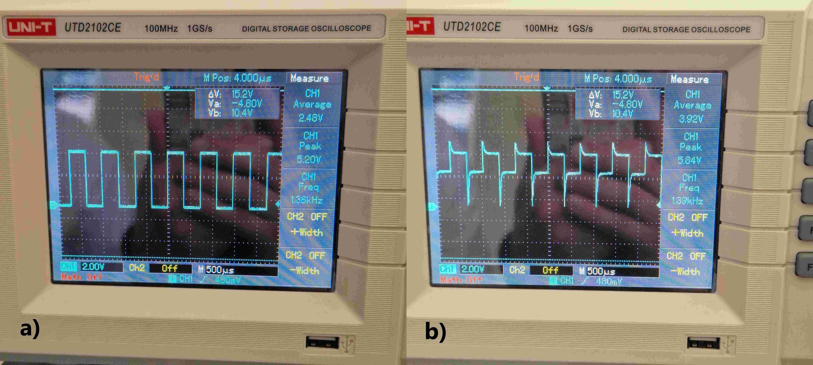
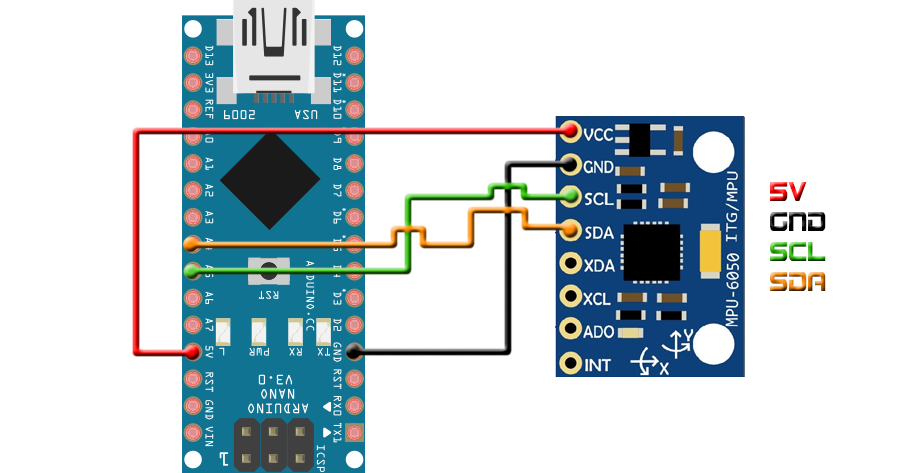
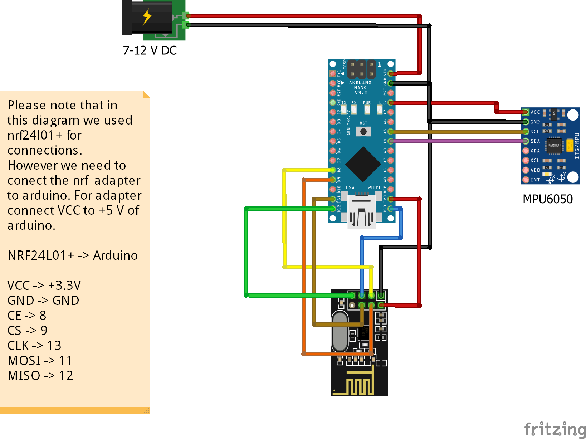

## Arduino Projeleri
### İkili sistem sayıcı (dijital pinleri çıkış olarak kullanma)
### Binary Counter (using digital pins as output)

Derste <b>binary</b> kelimesinin ikili sistem yâni 1 ve 0'lardan oluşan sistem olduğunu görmüştük. Bu kavramı sayısal tasarım (mantıksal devre tasarımı - logic circuits) dersinde True - False veya logic 1 - logic 0 olarak, Arduino'nun kendi ekosisteminde de özel tanımlanmış bir kelime olan HIGH - LOW ile görebilirsiniz. Buna Boolean cebir (Boolean algebra) deniyor.

<h4>Örnek Sınav Soruları</h4>
<ul>
    <li align="justify">Aşağıdaki devre şemasında <b>setup()</b> fonksiyonunda dijital pinlerin 0'dan başlayarak değil de 2'den başlayarak çıkış olarak tanımlandığını görüyoruz. İlk iki pinin dijital çıkış olarak tanımlanmaması neden dolayı olabilir?</li>
    <li align="justify">Aşağıdaki devre şemasında <b>loop()</b> foksiyonunda {a, b, c, d, e, f, g, h} değerleri oluşturulurken % operatörü kullanıldığı görülüyor. Bu ne manaya geliyor? Onluk sistemde bir byte'dan büyük olmayan bir sayıyı (e.g., 237) ikili sisteme çevirerek örnek üzerinde açıklayınız.</li>
</ul>

<h3>Üstten Basmalı Anahtar ile Dijital Giriş</h3>
<h3>Using Toggle Switch as Digital Input</h3>

Bir önceki projede led'lerin yanma süresi sabitti. Burada o süreyi potansiyometreden okuduğumuz değerle doğru orantılı olacak bir şekilde ayarlıyoruz. Potansiyometre ile analog girişin kullanımı aşağıdaki kare dalga üreteci projesinde de yer alıyor.

<h3>Potansiyometre ile Analog Girişi Kullanımı (Using Analog Inputs with Potentiometer)</h3>

#### Potansiyometre

Potansiyometreye ayarlı direnç dendiğinden daha önce bahsetmiştik. Bu devre elemanının;

<ul>
<li align="justify">Üç bacağı olduğunu,</li>
<li align="justify">İlk ve son bacaklarına Arduino'nun Vcc (5V) ve GND pinlerinin bağlandığını</li>
<li align="justify">Orta bacağının Arduino'nun analog girişlerinden bir tanesine (e.g., A0) bağlandığını</li>
<li align="justify">Analogdan dijitale çevirici (Analog to Digital Converter - ADC) aracılığıyla [0-5V] aralığında sürekli (continuous) değer alabilen analog bir sinyalin, [0-1023] aralığında bir tam sayıya (integer) dönüştürülerek alındığını,</li>
</ul>

görmüştük. Bir potansiyometreyi ve yukarıda listelenen Arduino bağlantılarını aşağıda görebilirsiniz.

 

<h3>Kare Dalga Üreteci (Square Wave Generator)</h3>

Bu <a href="https://youtu.be/6WdBsv1CyCg">deneyimizde</a> Arduino dijital çıkışlarından 13 no'lu pin olan D13'e hoparlör (veya buzzer) bağlayarak görev süresi (duty cycle) %50 olan frekansı potansiyometre tarafından manuel olarak ayarlanan kare dalga ürettik. Bu sinyali üstten basmalı anahtara (toggle switch) bastığımızda işitirken osiloskop ekranında aşağıda görüldüğü gibi iki farklı hâlde görüntüledik: a) Üstten basmalı anahtara basılmadığı (açık devre) durumunda, b) Üstten basmalı anahtara basıldığında (kapalı devre). Bu farklılığın açıklaması için bu <a href="https://www.youtube.com/watch?v=YVkS6jyvlRg">videoyu</a> izleyiniz.

<h3>MPU6050 Hareket Sensörü Kullanımı (Using MPU6050 Motion Sensor)</h3>

MPU6050 sensörü verisini Arduino'ya <a href="https://github.com/tockn/MPU6050_tockn" target="_blank">MPU6050_tockn</a> kütüphanesi yardımıyla okuyup Euler açılarını Arduino'nun seri port ekranında görüntüledik. Bu kütüphaneden esinlenerek bazı değişik özellikler ekleyip (e.g., sensör örnekleme frekansını ayarlama seçeneği, ivmemetre ve jiroskop verisi hassasiyeti ve max-min ölçüm değerleri) kendi kütüphanemiz olan <a href="https://github.com/mtahakoroglu/MPU6050_ZUPT" target="_blank">MPU6050_ZUPT</a> kütüphanesini oluşturduk. Bu kütüphaneye yapay zekâ yardımıyla yazdırdığımız Python kodlarını da ekleyerek MPU6050 verilerini gerçek zamanda <b>pygame</b> ve <b>matplotlib</b> paketleriyle <a href="https://www.youtube.com/watch?v=-zqW5ccxTFk">görselleştirdik</a>.

<h3>MPU6050 ile hesaplanan yunuslama açısı ile fırçasız motor hız kontrolü (Controlling brushless motor speed using pitch angle estimated with MPU6050)</h3>

Arkadaşlar, final sınavında bu soruyu soracağız. Kendi geliştirdiğimiz Arduino kütüphanesi olan <a href="https://github.com/mtahakoroglu/MPU6050_ZUPT" target="_blank">MPU6050_ZUPT</a>'da yer alan GetEuler.ino örneğini açıp gerekli Servo kütüphanesi komutlarını yazarak bu işi yapıyorduk. Bununla ilgili örnek video'yu kısa bir süre içinde buradan izleyebilirsiniz. <b>Not:</b> Bu kodu da kendi Arduino'larına yazıp fırçasız motorun hızını MPU6050 ile kontrol edenler final sınavından bir 20 puanı daha garantileyebilirler.

### MPU6050 ile Kontrol Edilen Robot

Bu projenin kumanda devresini kurup, Arduino'yu ilgili depodaki <a href="https://github.com/mtahakoroglu/gumushane-eem-216/blob/main/project/gesture-robot/transmitter/transmitter.ino">transmitter.ino</a> kodu ile programlayıp robotu nRF24l01 aracılığıyla MPU6050 ile kontrol edenler final sınavının 20 puanını almış sayılıyorlar.

Projenin videosuna <a href="https://www.youtube.com/watch?v=fec-XFwayz8&list=PLMoe16OQDeeCD2FydKfOrbsncrZ93XZBb&index=2">gesture robot</a> bağlantısından ulaşabilirsiniz.