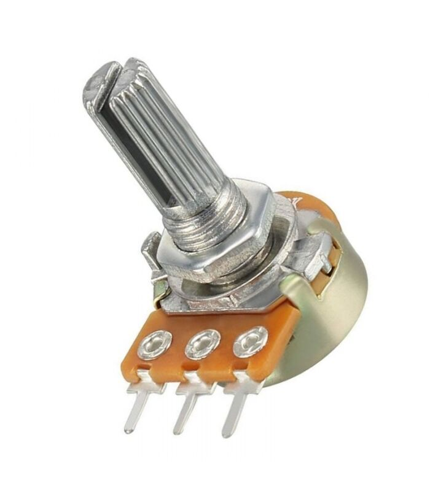

## Arduino Projeleri
### İkili sistem sayıcı (dijital pinleri çıkış olarak kullanma)
### Binary Counter (using digital pins as output)

Derste <b>binary</b> kelimesinin ikili sistem yâni 1 ve 0'lardan oluşan sisttem olduğunu görmüştük. Bu kavramı sayısal tasarım (mantıksal devre tasarımı - logic circuits) dersinde True - False veya logic 1 - logic 0 olarak, Arduino'nun kendi ekosisteminde de özel tanımlanmış bir kelime olan HIGH - LOW ile görebilirsiniz. Buna Boolean cebir (Boolean algebra) deniyor.

<h3>Üstten Basmalı Anahtar ile Dijital Giriş</h3>
<h3>Using Toggle Switch as Digital Input</h3>

Bir önceki projede led'lerin yanma süresi sabitti. Burada o süreyi potansiyometreden okuduğumuz değerler doğru orantılı olcak bir şekilde ayarlıyoruz. Potansiyometre ile analog girişin kullanımı aşağıdaki kare dalga üreteci projesinde de yer alıyor.

<h3>Potansiyometre ile Analog Girişi Kullanımı</h3>
<h3>Using Analog Inputs with Pot</h3>

<h3>Kare Dalga Üreteci</h3>
<h3>Square Wave Generator</h3>

<h3>MPU6050 sensörü kullanımı</h3>

MPU6050 sensörü verisini Arduino'ya <a href="https://github.com/tockn/MPU6050_tockn" target="_blank">MPU6050_tockn</a> kütüphanesi yardımıyla okuyup Euler açılarını Arduino'nun seri port ekranında görüntüledik. Bu kütüphaneden esinlenerek bazı değişik özellikler ekleyerek (e.g., sensör örnekleme frekansını ayarlama seçeneği, ivmemetre ve jiroskop verisi hassasiyeti ve max-min ölçüm değerleri) kendi kütüphanemiz olan <a href="https://github.com/mtahakoroglu/MPU6050_ZUPT" target="_blank">MPU6050_ZUPT</a> kütüphanesini geliştirdik. Bu kütüphaneye yapay zeka yardımıyla yazdırdığımız Python kodlarını da ekleyerek MPU6050 verilerini gerçek zamanda pygame ve matplotlib paketleriyle görselleştirdik.

<h3>MPU6050 sensöründen hesaplanan yunuslama açısı ile fırçasız motor hız kontrolü</h3>

Arkadaşlar, final sınavında bu soruyu soracağız. Kendi geliştirdiğimiz Arduino kütüphanesi olan <a href="https://github.com/mtahakoroglu/MPU6050_ZUPT" target="_blank">MPU6050_ZUPT</a>'da yer alan GetEuler.ino örneğini açıp gerekli Servo kütüphanesi komutlarını yazarak bu işi yapıyorduk. Bununla ilgili örnek video'yu kısa bir süre içinde buradan izleyebilirsiniz.

### MPU6050 ile Kontrol Edilen Robot

Projenin videosuna <a href="https://www.youtube.com/watch?v=fec-XFwayz8&list=PLMoe16OQDeeCD2FydKfOrbsncrZ93XZBb&index=2">gesture robot</a> bağlantısından ulaşabilirsiniz.